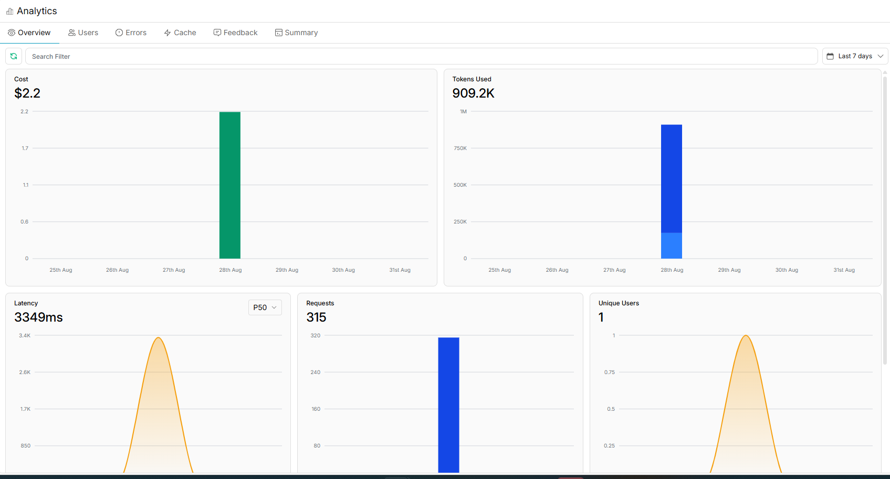
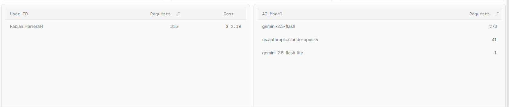

# Observability evidence

**Date:** 2026-08-28

Two layers, because neither is sufficient alone (`03_spec.md` §11):

- **Portkey** — per-call cost, latency, tokens and model, on the company
  gateway. It answers "what did this cost and how slow was it", and it carries
  the cheap-vs-frontier comparison in `evidence/04`. It does **not** see that a
  validator rejected a payload or that a human edited a draft.
- **Local step traces** (`agente/traza.py`) — node transitions, the action
  chosen and why, tool inputs and outputs, validation verdicts, retry reasons,
  gate decisions. Written per run to `traces/`, which is gitignored because raw
  traces contain conversation content.

What ships is curated by hand into this file, with synthetic personas.

## Measured through the gateway

From `eval/results/`, 42 agent runs over the design set:

| | `gemini-2.5-flash` | `claude-opus-5` |
|---|---|---|
| Tokens per lead | 3,717 | 13,708 |
| Model calls per lead | 2.1 | 2.9 |
| Seconds per lead | 13.4 | 30.9 |
| Total tokens | 104,076 (28 runs) | 191,909 (14 runs) |

---


### A. Normal run � the contradiction is caught

```
corrida 84f1d5b8da6f  lead L01  gemini-2.5-flash
  cargar {'lead': 'L01', 'canales': 'email (ana.ruiz@example.com)'}
  pide   buscar_corpus
  tool   buscar_corpus({'consulta': 'is the assessment visit charged'}) -> 4 pasajes [CCAA]
  decide escalar_a_ronald  � The lead was told the assessment visit is not charged because Pawtucke
  escalar {'lead': 'L01', 'motivo': 'The lead was told the assessment visit is not charged because Pawtucket is nearby. However, the corpus states that "The assessment visit is charged, it costs $300, and it costs the same for everyone. ', 'pasajes': 4, 'fallos': []}
  escalacion {'texto': 'Lead L01 � Ana Ruiz\nContact: email (ana.ruiz@example.com)\nProject: comercial, Office reception area, roughly 300 sq ft, Pawtucket, Rhode Island\n\nWHY THIS NEEDS YOU:\nThe lead was told the assessment visit is not charged because Pawtucket is nearby. However, the corpus states that "The assessment visit is charged, it costs $300, and it costs the same for everyone. The assessment fee does not depend on distance, on travel, or on where the property is." This is a direct contradiction that needs Ronald\'s attention before proceeding.\n\nWHAT THIS RESTS ON:\n  - [A] How RG Wallcovering works � confirmed by the owner\n  - [A] How RG Wallcovering works � confirmed by the owner\n\nNothing was sent to this person. Run 84f1d5b8da6f.'}
```

Escalation handed to Ronald:

```
Lead L01 � Ana Ruiz
Contact: email (ana.ruiz@example.com)
Project: comercial, Office reception area, roughly 300 sq ft, Pawtucket, Rhode Island

WHY THIS NEEDS YOU:
The lead was told the assessment visit is not charged because Pawtucket is nearby. However, the corpus states that "The assessment visit is charged, it costs $300, and it costs the same for everyone. The assessment fee does not depend on distance, on travel, or on where the property is." This is a direct contradiction that needs Ronald's attention before proceeding.

WHAT THIS RESTS ON:
  - [A] How RG Wallcovering works � confirmed by the owner
  - [A] How RG Wallcovering works � confirmed by the owner

Nothing was sent to this person. Run 84f1d5b8da6f.
```

### B. Failure injected after approval � recovered

```
corrida 4affa3267be2  lead L04  gemini-2.5-flash
  cargar {'lead': 'L04', 'canales': 'email (m.webb@example.com), phone (401-555-0142)'}
  decide preparar_correo_visita  � The lead has provided sufficient detail about the project type, scope,
  preparar {'tipo': 'correo', 'destinatario': 'm.webb@example.com', 'asunto': 'Regarding your restaurant wallcovering project', 'fuentes': []}
  gate_humano {'decision': 'aprobada', 'quien': 'ronald', 'editada': False}
  FALLO  ejecutar_irreversible: SMTP error: SMTPSenderRefused: 421 4.7.0 Temporary System Problem. Try
  recuperar {'herramienta': 'correo', 'motivo': 'SMTP error: SMTPSenderRefused: 421 4.7.0 Temporary System Problem. Try again later. (injected failure 1/1)', 'gastados': 1, 'restantes': 1}
  pide   redactar_correo
  FALLO  ejecutar_tool: herramienta desconocida: redactar_correo
  decide preparar_correo_visita  � The email offering an assessment visit was drafted and approved but fa
  preparar {'tipo': 'correo', 'destinatario': 'm.webb@example.com', 'asunto': 'Regarding your restaurant wallcovering project', 'fuentes': []}
  gate_humano {'decision': 'aprobada', 'quien': 'ronald', 'editada': False}
  ejecutar_irreversible {'tipo': 'correo', 'resultado': 'email sent to m.webb@example.com'}
```

Outcome: `email sent to m.webb@example.com`

---

## What trace B also shows, and is not hidden

After the injected SMTP failure, the model tried to call `redactar_correo`
directly from the decision node, where that tool is deliberately not bound —
drafting is a separate node so that deciding and acting can never be one step:

```
  pide   redactar_correo
  FALLO  ejecutar_tool: herramienta desconocida: redactar_correo
```

The graph rejected it, told the model, and the model recovered and decided
properly on the next turn. The system degraded correctly — an unknown tool is
answered rather than crashed on — but this is a rough edge worth naming: the
recovery message says "retry", and the model read that as permission to redraft
immediately rather than to decide again first. It cost one wasted call.

It is left as observed rather than patched. Changing the recovery wording now
would be tuning after the holdout has run, which `02_data_provenance.md` §2.4
commits against.

## The gateway dashboard

Captured 2026-08-31, window "Last 7 days" (25–31 Aug). The dashboard's own
export is disabled on this account, so these are screenshots.





Readable off the dashboard:

| | |
|---|---|
| Cost | **$2.19** |
| Tokens | 909.2K |
| Requests | 315 |
| Latency P50 | 3,349 ms |
| Unique users | 1 |
| By model | `gemini-2.5-flash` 273 · `us.anthropic.claude-opus-5` 41 · `gemini-2.5-flash-lite` 1 |

$2.19 is the whole project — every call from the first catalog check to the
last holdout run, not just the runs reported above.

### What this confirms, and what it does not

**All activity falls on a single day.** 25–27 and 29–31 Aug are flat. Every
commit in this repository is dated 2026-08-28, and `06_effort.md` declares
13h15–14h15 in one sitting. The gateway is an independent record of that, and
it agrees.

**The frontier run reconciles almost exactly.** `claude-opus-5` is configured
only as `MODELO_FRONTIER` and was used only for the comparison run in
`evidence/04`. The dashboard counts 41 calls to it; `diseno_frontier_v1.jsonl`
counts 40. The one extra is unattributed — most likely the catalog check before
the run — and I have not tried to explain it away.

**The cheap-model counts do not reconcile, and should not.** The dashboard
counts 273 calls to `gemini-2.5-flash`; the three cheap-model result files
account for 162 (60 + 73 + 29). The remaining ~111 are
development: manual runs, the injected-failure work, the S1 citation fix, and
the demo. The dashboard measures the whole day of building; the tables above
measure four specific runs. Same for tokens — 909.2K on the gateway against
472K totalled across the result files.

**One call is not this project's.** `gemini-2.5-flash-lite` appears once. This
repo configures two models (`agente/config.py`, `.env.example`) and that is not
one of them. It is on the same account inside the same window, so I cannot rule
it out from the dashboard alone, but nothing here calls it.

**P50 latency is not the per-lead figure.** 3,349 ms is the median *model call*
across all 315. The 13.4 s and 30.9 s per lead in the table above are whole
runs — two to three model calls plus retrieval, validation and gate handling.
Retrieval never appears on this dashboard at all: embeddings run locally
through `fastembed`, so they cost nothing here and add latency the gateway
cannot see.

**No lead data is on this dashboard.** It carries the developer's own account
name as the single user; it does not carry prompt or response bodies.
